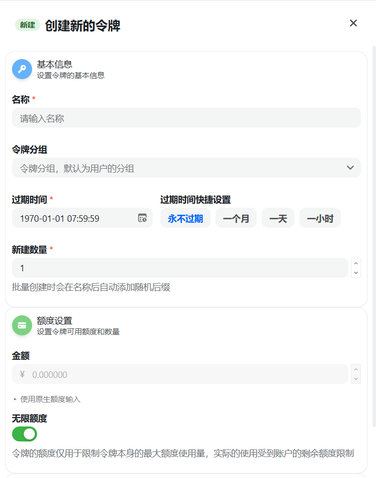
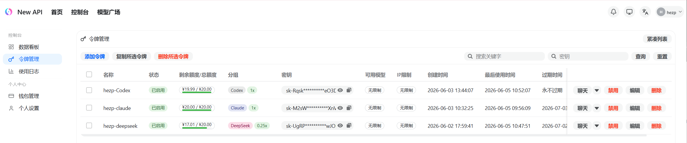
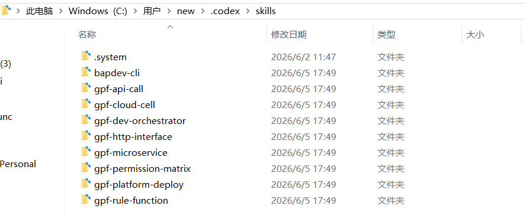
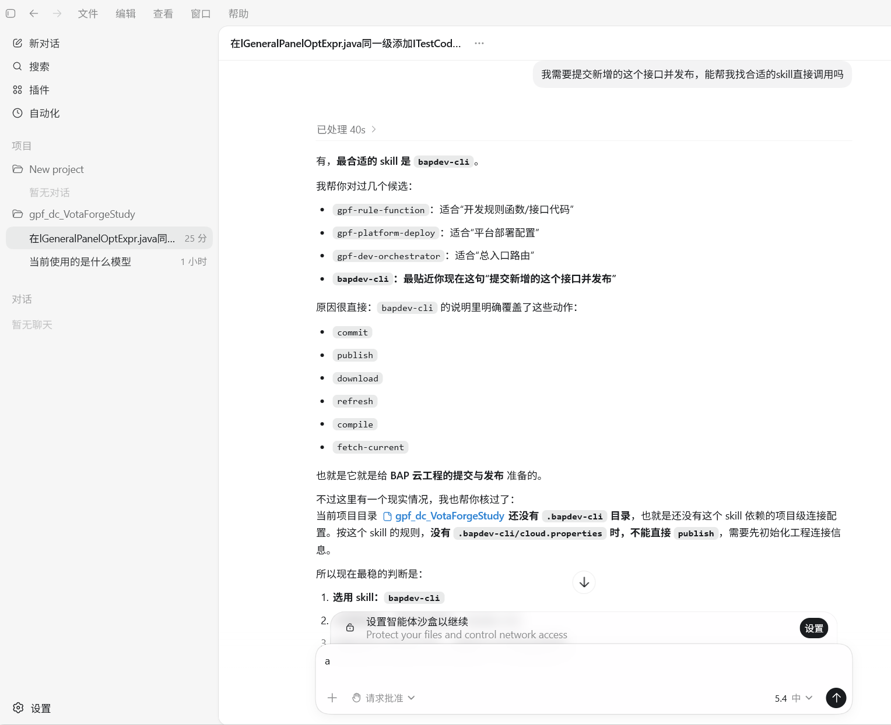
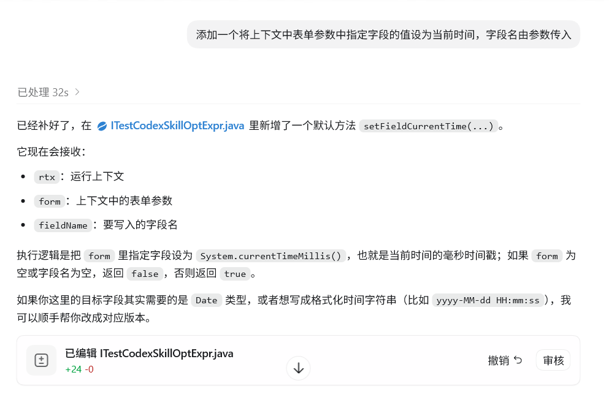
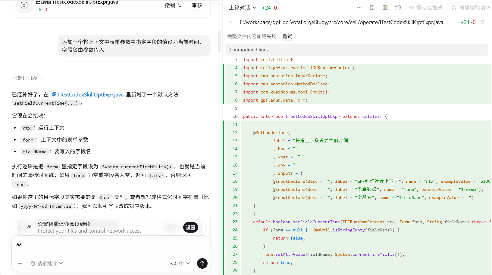

## 1. 获取密钥

- **登录New API：** 登录地址（https://token.kwaidoo.com/）， 用户名为 姓的全拼+名的首字母， 如：”caizz“， 密码则是 用户名123!@#，例如：”caizz123!@#“

- **添加令牌：** 操作步骤为左上方点击 `控制台` → 左侧菜单选择 `令牌管理` → 点击 `添加令牌`。设置令牌名称、过期时间和额度根据需要设置，令牌分组会影响能使用的模型，需要在 `模型广场` 中查看需要的模型属于哪个分类
- 
- **复制密钥：**设置完成提交后，在表格中点击密钥的复制按钮即可获取到密钥



## 2. 下载与安装配置

- **获取安装包:** 访问 Codex 官网(https://chatgpt.com/zh-Hans-CN/codex/)在页面中央有系统对应的下载按钮。

- **安装登录:** 双击运行下载的安装包即可安装，在安装完成后选择 `使用其他方式登录` 然后粘贴API Key。

  

- **配置应用:** 

  1. 打开配置文件：在应用左下角点击 `设置`  → 在左侧选中 `配置`  → 点击配置页面中灰色小字 打开`config.toml↗`
  2. 添加配置：为了使用New API中提供的模型需要在config.toml中现添加下面配置，并保存后重启

  ```toml
  model_provider = "kwaidoo"
  model = "gpt-5.5"
  model_reasoning_effort = "medium"
  preferred_auth_method = "apikey"
  
  [model_providers.kwaidoo]
  name = "kwaidoo"
  base_url = "https://token.kwaidoo.com/v1"
  ```

## 3. 添加项目和Skill

- 添加项目：在主界面左侧点击 `项目` ，选择 `使用现有文件夹`进入项目文件添加

- 添加skill：资源管理器中打开C盘中系统用户文件夹下的 .codex\skills路径，将skill文件放入其中就完成了skill添加

  

- 使用skill：在界面输入框指定要使用的skill，或者让模型查找合适的skill都可以



## 4. 使用生成操作函数

- **选择项目文件：** 从主界面开始对话，在输入框左下方点击选择文件夹选择项目文件的位置打开。
- **对话生成函数：** 在输入框中输入你希望添加的操作函数的功能，尽可能描述请求你会提供哪些参数和希望得到怎么样的结果。如果之前没添加过操作函数或者想要更换位置也需要列出来，默认情况下操作函数会添加到已有的接口中。填写需求按回车执行，期间会有多次请求读写权限的弹窗



- **检查并发布：** 生成完成后可以直接点击 `审核` 进行检查。检查完毕后需要到IDEA使用 Bap插件提交并发布



## 5. **VotaForge中添加操作函数**

1. 进入工作室，在右上方找到【扩展中心】，进入之后选择【操作函数】

 

 

2.   在操作函数右上方点击【+添加函数】进行添加

 

 

3.  必填内容中，  **“函数编号”** 为方便管理通常采用工作室ID + 函数用下划线隔开的方式命名，  **“操作名称”** 为该操作在界面中显示的名称。

 

4.   **“代码路径”** 和 **“方法名称”** 为函数所在的接口位置和函数名称，可以在idea中选中函数后右键选择复制引用，这两项要填的内容在粘贴内容的井号两侧

 

 


## 6.配置使用操作函数

添加完操作函数后可以在【结构调整】和【视图调整】中配置使用

1.在【结构调整】中 【按钮】的 **”按钮动作“** 添加操作函数可以在按钮点击时触发函数调用，在调用时会同时将表单上的数据以 **“formData”**  参数传到后台，并转换成上下文  **“$form$”** ,所以在按钮动作中配置的操作函数可以使用 **“$form$”** 参数，通常用于提交表单的时候检查被修改表单数据

 


2.希望通过表单组件交互触发可在【视图调整】中组件的【运行时】中添加，例如在一个请假表单中输入开始和结束时间，要算出准确的请假时长就可以使用操作函数进行计算，避免了在赋值指令中写过长的代码。

2.1 在完成发布函数和在扩展中心添加后，需要先在【结构调整】中的【事件】中添加 **“事件动作”** 为目标操作函数的事件，配置好函数需要配置的参数（不是在上下文获取值的参数）。


​	

2.2 在需要监听事件的组件的【运行时】中选中合适的事件添加指令。我们这选择“开始时间”的“值改变”事件中添加指令执行计算。


2.3 调用操作函数是通过调用面板的事件完成的，对应的指令是【调用SDK】，在指令的配置中 **“方法名”** 选择 **“调用面板事件”** ， **“面板编号”** 和 **“事件名称”** 填写当前面板编号和刚刚添加的事件名称


2.4   **“事件参数”** 可以配置操作函数所需的上下文参数，参数名和操作函数@MethodDeclare中 **“exampleValue”** 填写的**$**符包裹的文字一致。需要注意这里填的不能是octo.cm.enums.GpfContextSystemVarKey和octo.cm.enums.ContextSystemVarKey类中包括的系统固定的参数名称。


2.5在下方【+选项】中选择 **“结果变量名”** ，可以将函数返回结果添加到当前事件动作的 **$results** 中。在后续的指令可以通过 **$results** 使用


2.6填写配置指令并保存后即可再【预览应用】中测试预览


3.在【视图调整】的组件【运行时】的事件动作中也可以调用面板按钮，”按钮动作“中配置的操作函数也会被调用。但是因为不是直接点击按钮，这里的表单数据需要通过 **“事件参数”** 补充。

3.1 表单数据可以通过 **“获取组件值”** 指令，目标组件一项中选择 **“表单(xxxxxx)”** 并添加“结果变量名”将结果添加到 **$results** 中。也可以不用指令收集，直接使用 **”$scope.record“** 变量


3.2 调用面板按钮是通过 **”调用SDK“** 指令完成，在方法名中选择“调用面板按钮（新版）”，填写面板编号和按钮名称。表单的数据会默认使用“formData”作为参数名，所以 **“表单数据”** 不需要像“事件参数”那样的结构，直接填写表单数据的变量就行，但依然要点击右上方的“fx”使用函数。


3.3填写配置指令并保存后即可再【预览应用】中测试预览


