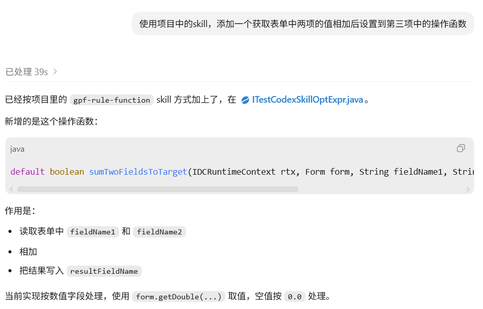
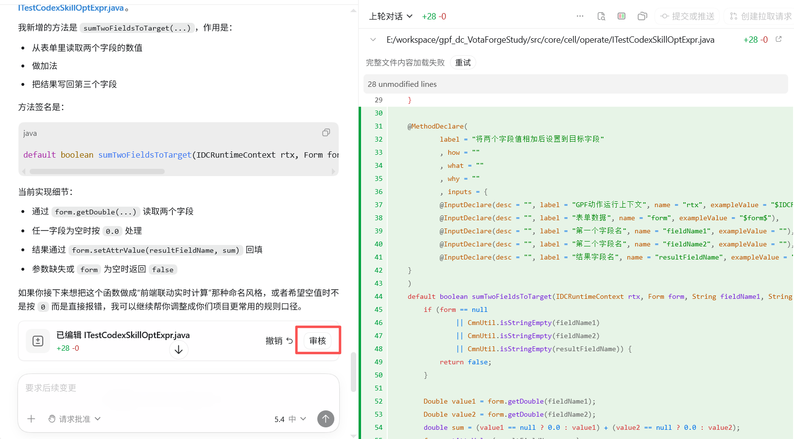

本文档以 Codex 为例，完整演示如何利用专属大模型辅助开发，实现操作函数的快速生成、发布，并最终在 VotaForge 平台中完成配置与无缝调用。

整个核心工作流包含三个阶段：

1. **环境与工程准备**：获取 New API 密钥并完成 Codex 客户端的私有化模型接入。
2. **AI 辅助代码生成**：通过引入特定的 Skill 并描述需求，自动生成并在 IDEA 中发布操作函数代码。
3. **VotaForge 平台集成**：在工作室中注册函数，并将其灵活绑定至表单组件或按钮交互的事件流中。

## 1. 获取密钥

- **登录 New API**：访问控制台（ https://token.kwaidoo.com/ ）。用户名为“姓全拼+名首字母”（例：`caizz`），密码为“用户名+123!@#”（例：`caizz123!@#`）。
- **添加令牌**：在左侧菜单依次进入 **`控制台`** -> **`令牌管理`** -> **`添加令牌`**。请根据实际需要设置令牌名称、过期时间和额度。*注意：令牌分组会决定可调用的模型范围，建议先在 **`模型广场`** 确认所需模型的分类*。


- **复制密钥**：配置提交后，在表格操作列点击“复制”按钮即可提取密钥。


## 2. 下载与安装配置

- **获取安装包**：访问 Codex 官网 ( https://chatgpt.com/zh-Hans-CN/codex/ )，下载当前系统对应的安装包并双击运行。
- **安装登录**：安装完成后，选择 **`使用其他方式登录`**，然后粘贴获取的 API Key。


- **配置应用以接入模型**：
  1. **打开配置文件**：点击应用左下角 **`设置`** -> 选择左侧 **`配置`** -> 点击右侧灰色提示语中的 **`打开 config.toml↗`**。
  2. **修改配置**：为了调用 New API 提供的模型，需先在文件末尾追加以下配置。保存文件后重启 Codex 即可生效。

```toml
model_provider = "kwaidoo"
model = "gpt-5.5"
model_reasoning_effort = "medium"
preferred_auth_method = "apikey"

[model_providers.kwaidoo]
name = "kwaidoo"
base_url = "https://token.kwaidoo.com/v1"
```

## 3. 添加项目和 Skill

- **添加项目**：在 Codex 主界面左侧点击 **`项目`**，选择 **`使用现有文件夹`** 导入您的工程目录。
- **添加 Skill**：打开资源管理器，进入当前系统用户目录下的 `.codex\skills` 文件夹，将预设的 skill 文件放入该目录即可完成安装。


- **使用 Skill**：在对话输入框中直接 @ 指定要使用的 skill，或者通过自然语言让模型自行匹配合适的 skill 均可。


## 4. 生成操作函数

- **对话生成函数**：在对话框中详细描述所需操作函数的功能。建议尽可能清晰地列出：**入参条件**、**预期返回结果**，以及**期望注入的接口位置**（若未指定位置，代码默认追加至现有接口中）。按回车执行后，Codex 在生成期间会多次弹窗请求本地文件的读写权限，请允许通过。



- **检查与发布**：代码生成完毕后，可直接点击 **`审核`** 预览改动。确认无误后，需切换至 IDEA，使用 Bap 插件完成最终的代码提交与发布。



## 5. VotaForge 中注册操作函数

1. 进入目标工作室，点击右上角的 **`【扩展中心】`**，并在左侧菜单选择 **`【操作函数】`**。
2. 点击界面右上角的 **`【+添加函数】`**。
3. **填写基础信息**：
   - **函数编号**：为规范管理，通常采用 `工作室ID_函数名` 的下划线分隔格式命名。
   - **操作名称**：此名称将直接展示在 VotaForge 的界面配置中。
4. **绑定代码路径**：
   - **代码路径** 与 **方法名称** 需与 IDEA 中生成的函数接口位置与函数名严格对应。
   - *小技巧：可在 IDEA 中选中目标函数，右键选择“复制引用”(Copy Reference)，粘贴后提取 `#` 号两侧的完整类路径与方法名填入即可*。

## 6. 配置与调用操作函数

注册完成后，即可在【结构调整】和【视图调整】两大模块中配置该函数的触发逻辑。

### 场景一：通过按钮点击触发（结构调整）

在【结构调整】中，为按钮配置 **`按钮动作`** 时可直接绑定操作函数。 触发时，系统会自动将当前表单数据封装为 `formData` 参数传给后端，并转换为上下文变量 `$form$`。因此，在按钮动作中配置的函数可直接读取 `$form$` 参数，非常适合用于表单提交前的数据校验与拦截。


### 场景二：通过表单组件交互触发（视图调整）

如果希望通过用户输入（如值改变）触发联动计算，需在【视图调整】的目标组件 **`运行时`** 中进行配置。例如：在请假表单中监听“开始/结束时间”的变化，调用操作函数实时计算出精确请假时长，从而避免在前端赋值指令中编写冗长代码。

**具体配置步骤：**

1. **声明事件动作**：函数发布并注册后，先在【结构调整】的【事件】面板中，新增一个 **`事件动作`** 指向目标操作函数，同时在此处配置好该函数所需的参数映射（此处非取值赋值，仅做参数定义）。
2. **绑定监听指令**：在【视图调整】中选中需要监听的组件（如“开始时间”），在其【运行时】的“值改变”事件中添加后续指令。
3. **调用面板事件**：添加 **`【调用SDK】`** 指令。在配置项的 **“方法名”** 处选择“调用面板事件”，并准确填写当前 **“面板编号”** 及步骤 1 中定义的 **“事件名称”**。
4. **传递事件参数**：配置传递给函数的参数值。此处的参数名必须与后端代码 `@MethodDeclare` 注解中 `exampleValue` 属性定义的（由 `$` 符包裹的文字）保持一致。*注意：此处参数名严禁使用 `octo.cm.enums.GpfContextSystemVarKey` 及 `ContextSystemVarKey` 类中包含的系统内置固定参数名*。
5. **接收返回结果**：在下方点击 **`【+选项】`**，选择 **“结果变量名”**，将后端函数的返回值存储至当前事件动作的 **`$results`** 变量中，以便后续的指令节点继续使用。
6. **保存测试**：保存所有指令配置后，在 **`【预览应用】`** 中进行功能验证。

### 场景三：在运行时中调用面板按钮（进阶视图调整）

在组件【运行时】的事件动作中，也可以间接触发已绑定在面板“按钮动作”中的操作函数。但由于此场景下并非直接点击按钮，必须手动抓取并补充表单数据传参。

1. **收集表单数据**：可使用 **`【获取组件值】`** 指令，目标组件选择“表单(xxxxxx)”，添加“结果变量名”将结果塞入 `$results` 中；或者更直接地，无需指令收集，直接使用系统内置变量 **`$scope.record`** 引用当前数据。
2. **模拟按钮调用**：添加 **`【调用SDK】`** 指令，方法名选择“调用面板按钮（新版）”，并填写面板编号和按钮名称。
3. **传递 formData**：因为通过按钮触发时默认以 `formData` 接收参数，在“表单数据”配置项中不需要像事件参数那样去构建复杂结构，直接填入步骤 1 收集到的表单变量即可。*注意：依然需要点击右上角的 **`fx`** 切换为函数模式进行填写*。
4. **保存测试**：配置完成后保存，并在 **`【预览应用】`** 中进行测试预览。
