## **事前需要**

1. 需要先申请好VotaForge环境
2. 在gpfdc中添工程

  	2.1. 登录gpfdc，点击右上角设置

  	2.2. 在左侧目录选中【 工程管理】，在右侧表格中添加一项工程

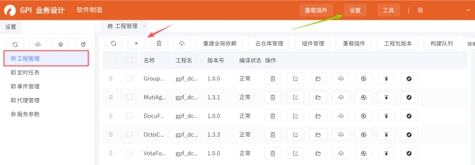 

 

## **1.****下载BAP**

下载地址【https://github.com/LHR-1112/BapDevTool/releases】，下载后不需要解压

 

## **2.****安装BAP**

**1.** 点击idea右上角齿轮按钮，在下拉菜单中选择【插件】。

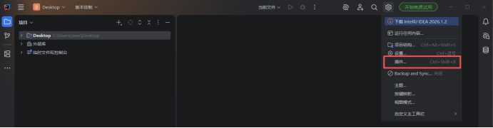 

 

**2.** 在插件界面继续点击右上角齿轮按钮，选中【从磁盘安装插件】，选择刚刚下载的BAP压缩包添加

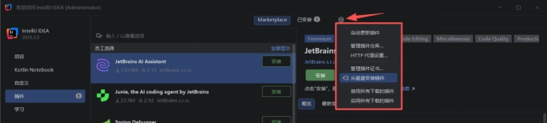 

 

**3.** 添加插件并应用后需要重启idea，重启后就能在顶部菜单栏最右侧找到Bap（顶部菜单栏自动隐藏的话，点击左上idea的log右侧按钮就能展开

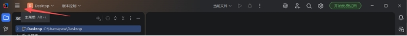 

 

## **3.****下载工程**

**1.** 在菜单栏中打开Bap，选择【下载工程】

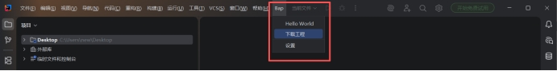 

 

**2.** 在弹窗的对话框中“服务器地址”一项中填写websocket的地址，将之前申请的VotaForge的地址协议从“https”改为为“wss”，并在路径后添加443端口，将应用名“VotaForge”改成“websocket”，（例如“https://office.kwaidoo.com/hezptest/VotaForge/”改为“wss://office.kwaidoo.com:443/hezptest/websocket”

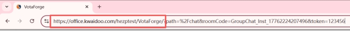 

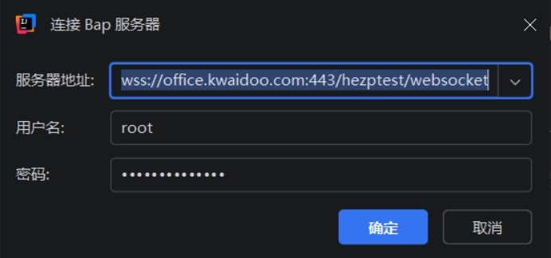 

 

**3.** 用户名默认为“root”，密码默认为“k!w@a#i2d0o1o9”

 

**4.** 点击确认后，“选择工程”一项中选择事前准备的工程，确认后即可下载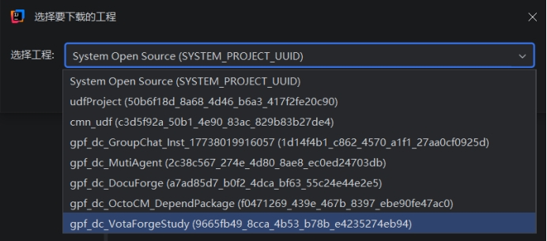

 

**5.** 建议下载时选择“作为独立项目打开”然后项目存放路径，否则项目将下载到当前idea打开的路径。待右下角进度条慢之后打开项目

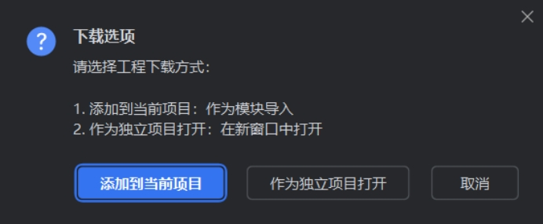 

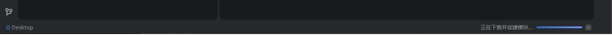 

## **4.****添加Skill**

**1.**在Idea可以在【插件】中添加GitHub Copilot插件

 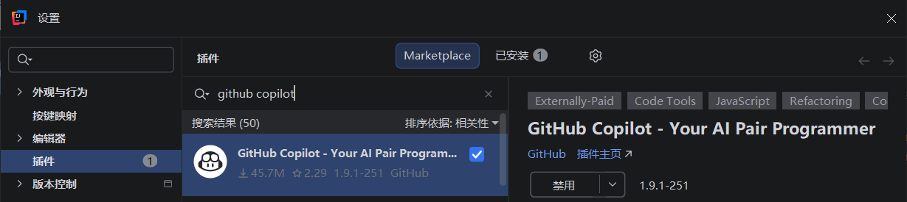

**2.**添加插件后在项目的根目录添加**”.github“**文件夹后将skills放入其中

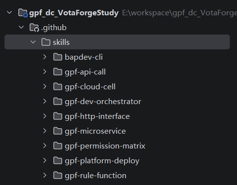

**3.**在右侧打开 Copilot插件就可以使用skill了，

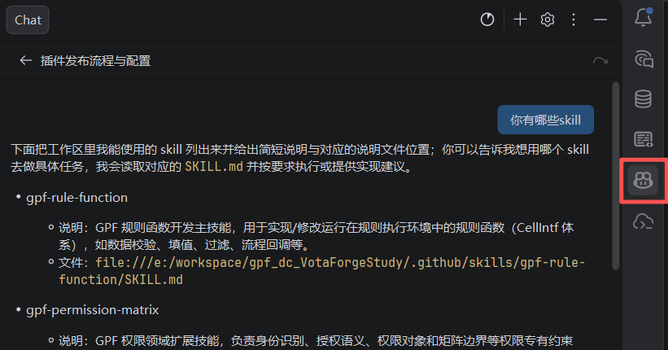

## **5.****发布操作函数**

**1.**在项目的“src/core”路径下创建“cell”软件包（名字需要为“cell”），之后在其下面按业务需要添加下一个软件包

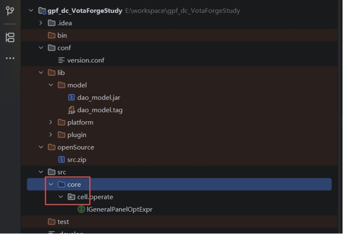 

 

**2.** 在软件包中添加接口，接口需要继承CellIntf

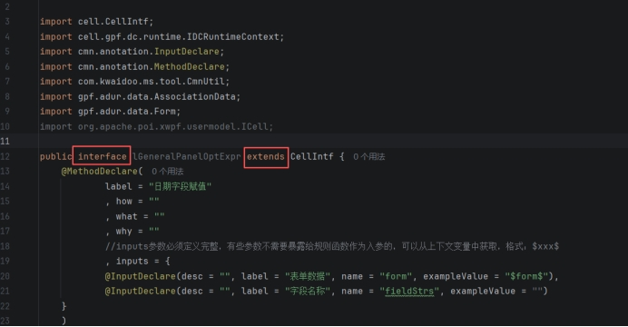 

 

**3.** 接口函数现需要添加 @MethodDeclare注解，注解中的 inputs中填写的@InputDeclare的“name”一项需要和函数的参数名保持一致，需要用到系统的在“exampleValue”填写系统参数的名称（具体有哪些可以在octo.cm.enums.GpfContextSystemVarKey和octo.cm.enums.ContextSystemVarKey中查看）

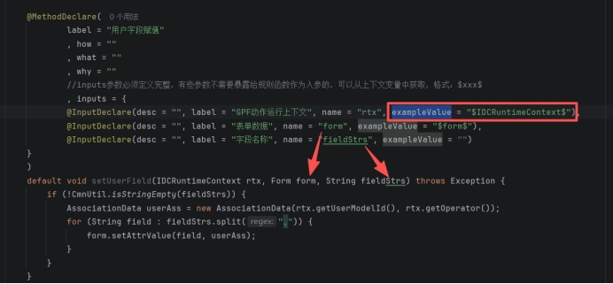 

 

**4.** 代码开发完毕后再idea左侧工具栏中的【Bap Changes】中提交修改，并在根目录右键菜单中【发布插件】

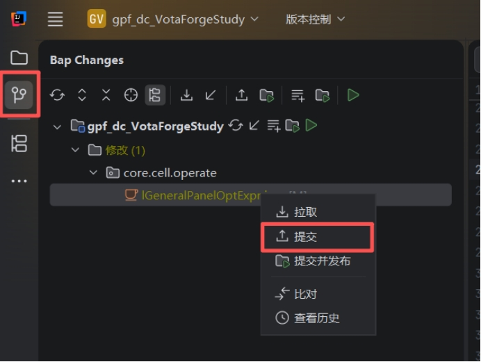 

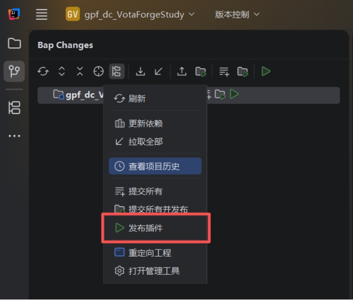 

 

 

## **6.** **VotaForge中添加操作函数**

**1.** 进入工作室，在右上方找到【扩展中心】，进入之后选择【操作函数】

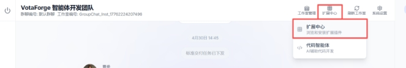 

 

**2.** 在操作函数右上方点击【+添加函数】进行添加

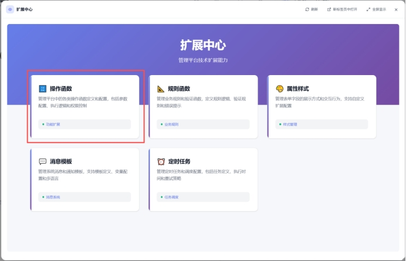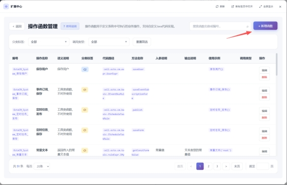 

 

**3.** 必填内容中，***\*“函数编号”\****为方便管理通常采用工作室ID + 函数用下划线隔开的方式命名，***\*“操作名称”\****为该操作在界面中显示的名称。

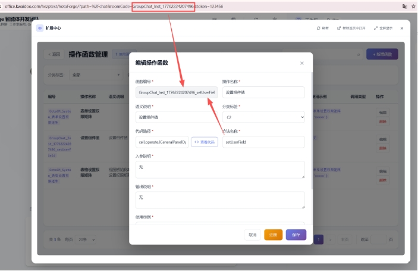 

**4.** ***\*“代码路径”\****和***\*“方法名称”\****为函数所在的接口位置和函数名称，可以在idea中选中函数后右键选择复制引用，这两项要填的内容在粘贴内容的井号两侧

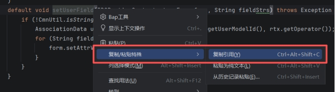 

 

 

**5.** 填写完表单完成炒作函数添加后就能在***\*按钮动作\****或者***\*事件动作\****在使用

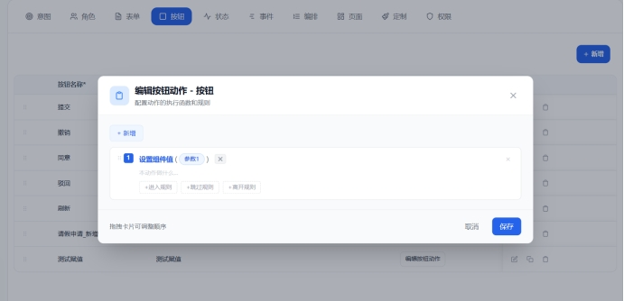 

 

 