## **前期准备**

1. 需要先申请好VotaForge环境
2. 在gpfdc中添加工程

  	2.1. 登录gpfdc，点击右上角设置

  	2.2. 在左侧目录选中【 工程管理】，在右侧表格中添加一项工程

 

 

## 1.下载BAP

下载地址【https://github.com/LHR-1112/BapDevTool/releases】，下载后不需要解压

 

## 2.安装BAP

**1.**  点击idea右上角齿轮按钮，在下拉菜单中选择【插件】。

 

 

**2.**  在插件界面继续点击右上角齿轮按钮，选中【从磁盘安装插件】，选择刚刚下载的BAP压缩包添加

 

 

**3.**  添加插件并应用后需要重启idea，重启后就能在顶部菜单栏最右侧找到Bap（顶部菜单栏自动隐藏的话，点击左上idea的logo右侧按钮就能展开

 

 

## 3.下载工程

**1.**  在菜单栏中打开Bap，选择【下载工程】

 

 

**2.**  在弹窗的对话框中“服务器地址”一项中填写websocket的地址，将之前申请的VotaForge的地址协议从“https”改为“wss”，并在路径后添加443端口，将应用名“VotaForge”改成“websocket”（例如“https://office.kwaidoo.com/hezptest/VotaForge/”改为“wss://office.kwaidoo.com:443/hezptest/websocket”）

 

 

 

**3.**  用户名默认为“root”，密码默认为“k!w@a#i2d0o1o9”

 

**4.**  点击确认后，“选择工程”一项中选择事前准备的工程，确认后即可下载

 

**5.**  建议下载时选择“作为独立项目打开”然后选择项目存放路径，否则项目将下载到当前idea打开的路径。待右下角进度条满之后打开项目

 

 


## 4.添加Skill

**1.**  可以在 IDEA 的【插件】中添加GitHub Copilot插件

 

**2.**  添加插件后在项目的根目录添加**.github**文件夹后将skills放入其中


**3.**  在右侧打开 Copilot插件就可以使用skill了


## 5.发布操作函数

**1.**  在项目的**“src/core”**路径下创建**“cell”**软件包（名字需要为“cell”），之后在其下面按业务需要添加下一个软件包

 

 

**2.**  在软件包中添加接口，接口需要继承CellIntf

 

 

**3.**  接口函数上需要添加 **@MethodDeclare**注解，注解中的 **inputs**中填写的@InputDeclare的**“name”**一项需要和函数的参数名保持一致，在需要从上文中获取参数时，则需要填写 **“exampleValue”**。系统内有一些固定系统参数可以使用，需要自定义的上下文变量作为参数时需要注意不能和系统参数重名。具体有哪些可以在octo.cm.enums.GpfContextSystemVarKey和octo.cm.enums.ContextSystemVarKey中查看

```java
@MethodDeclare(
            label = "用户字段赋值"
            , how = ""
            , what = ""
            , why = ""
            //inputs参数必须定义完整，有些参数不需要暴露给规则函数作为入参的，可以从上下文变量中获取，格式：$xxx$
            , inputs = {
            @InputDeclare(desc = "", label = "GPF动作运行上下文", name = "rtx", exampleValue = "$IDCRuntimeContext$"),
            @InputDeclare(desc = "", label = "表单数据", name = "form", exampleValue = "$form$"),
            @InputDeclare(desc = "", label = "字段名称", name = "fieldStrs", exampleValue = "")
    }
    )
    default boolean setUserField(IDCRuntimeContext rtx, Form form, String fieldStrs) throws Exception {
        if (!CmnUtil.isStringEmpty(fieldStrs)) {
            AssociationData userAss = new AssociationData(rtx.getUserModelId(), rtx.getOperator());
            for (String field : fieldStrs.split(",")) {
                form.setAttrValue(field, userAss);
            }
            return true;
        }
        return false;
    }
```

 

**4.**  代码开发完毕后在IDEA左侧工具栏中的【Bap Changes】中提交修改，并在根目录右键菜单中【发布插件】

 

 

 

 

## 6. **VotaForge中添加操作函数**

**1.** 进入工作室，在右上方找到【扩展中心】，进入之后选择【操作函数】

 

 

**2.**   在操作函数右上方点击【+添加函数】进行添加

 

 

**3.**  必填内容中，**“函数编号”**为方便管理通常采用工作室ID + 函数用下划线隔开的方式命名，**“操作名称”**为该操作在界面中显示的名称。

 

**4.**  **“代码路径”**和**“方法名称”**为函数所在的接口位置和函数名称，可以在idea中选中函数后右键选择复制引用，这两项要填的内容在粘贴内容的井号两侧

 

 


## 7.配置使用操作函数

添加完操作函数后可以在【结构调整】和【视图调整】中配置使用

**1.**在【结构调整】中 【按钮】的**”按钮动作“**添加操作函数可以在按钮点击时触发函数调用，在调用时会同时将表单上的数据以**“formData”** 参数传到后台，并转换成上下文 **“$form$”**,所以在按钮动作中配置的操作函数可以使用**“$form$”**参数，通常用于提交表单的时候检查被修改表单数据

 


**2.** 希望通过表单组件交互触发可在【视图调整】中组件的【运行时】中添加，例如在一个请假表单中输入开始和结束时间，要算出准确的请假时长就可以使用操作函数进行计算，避免了在赋值指令中写过长的代码。

**2.1 **在完成发布函数和在扩展中心添加后，需要先在【结构调整】中的【事件】中添加**“事件动作”**为目标操作函数的事件，配置好函数需要配置的参数（不是在上下文获取值的参数）。

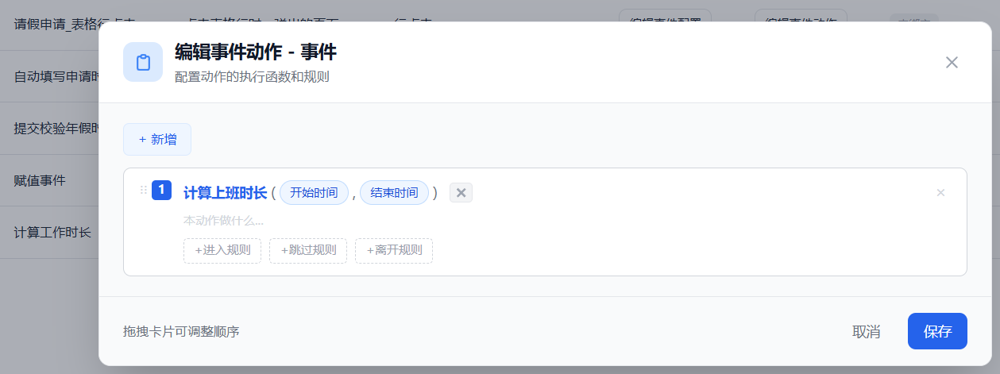

​	

**2.2** 在需要监听事件的组件的【运行时】中选中合适的事件添加指令。我们这选择“开始时间”的“值改变”事件中添加指令执行计算。

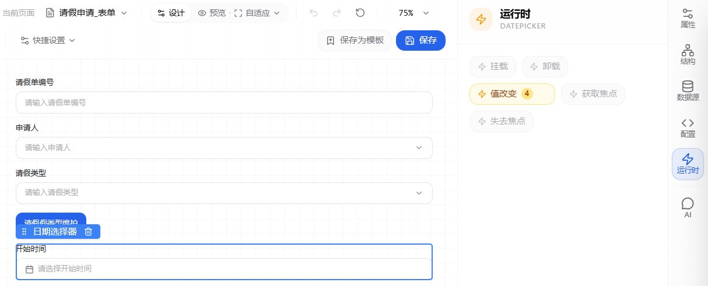


**2.3** 调用操作函数是通过调用面板的事件完成的，对应的指令是【调用SDK】，在指令的配置中**“方法名”**选择**“调用面板事件”**，**“面板编号”**和**“事件名称”**填写当前面板编号和刚刚添加的事件名称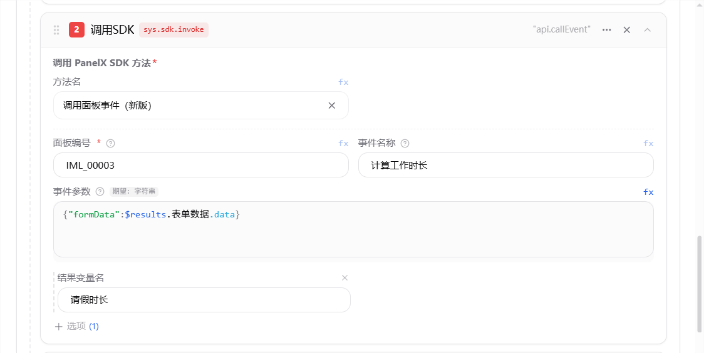


**2.4** **“事件参数”**可以配置操作函数所需的上下文参数，参数名和操作函数@MethodDeclare中**“exampleValue”**填写的**$**符包裹的文字一致。需要注意这里填的不能是octo.cm.enums.GpfContextSystemVarKey和octo.cm.enums.ContextSystemVarKey类中包括的系统固定的参数名称。

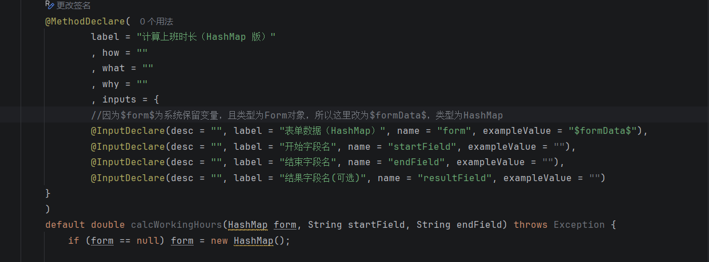


**2.5**在下方【+选项】中选择**“结果变量名”**，可以将函数返回结果添加到当前事件动作的**$results**中。在后续的指令可以通过**$results**使用

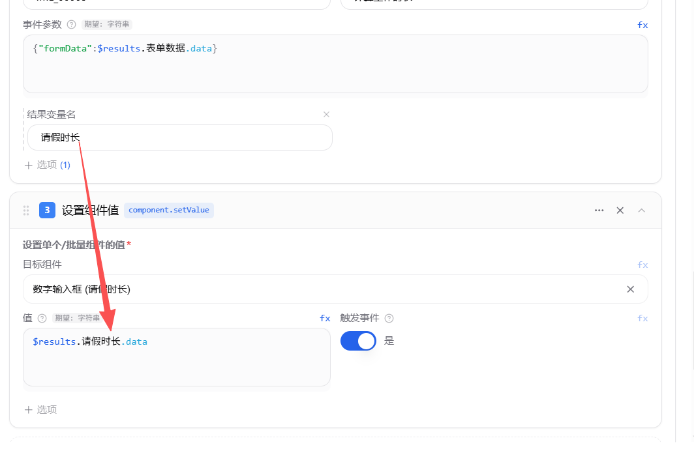

**2.6**填写配置指令并保存后即可再【预览应用】中测试预览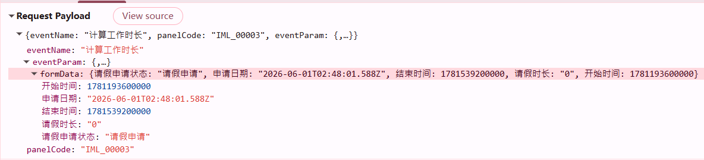

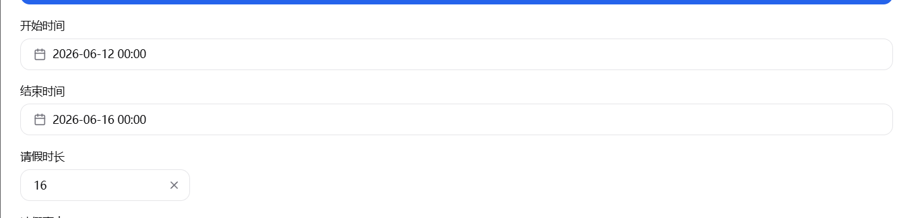


**3.** 在【视图调整】的组件【运行时】的事件动作中也可以调用面板按钮，”按钮动作“中配置的操作函数也会被调用。但是因为不是直接点击按钮，这里的表单数据需要通过**“事件参数”**补充。

**3.1** 表单数据可以通过**“获取组件值”**指令，目标组件一项中选择**“表单(xxxxxx)”**并添加“结果变量名”将结果添加到**$results**中。也可以不用指令收集，直接使用**”$scope.record“**变量

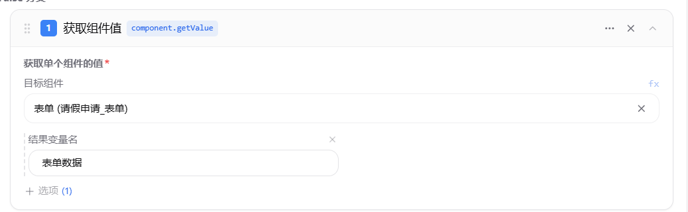

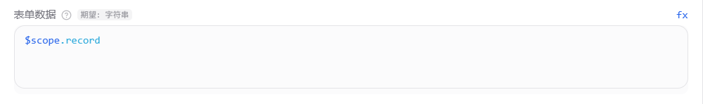


**3.2** 调用面板按钮是通过**”调用SDK“**指令完成，在方法名中选择“调用面板按钮（新版）”，填写面板编号和按钮名称。表单的数据会默认使用“formData”作为参数名，所以**“表单数据”**不需要像“事件参数”那样的结构，直接填写表单数据的变量就行，但依然要点击右上方的“fx”使用函数。

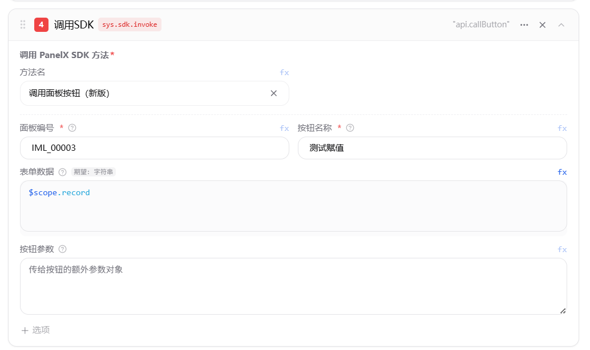

**3.3**填写配置指令并保存后即可再【预览应用】中测试预览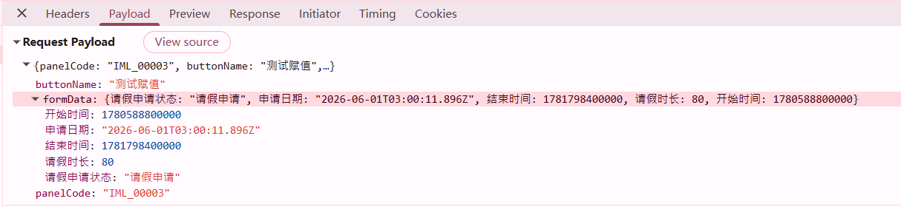

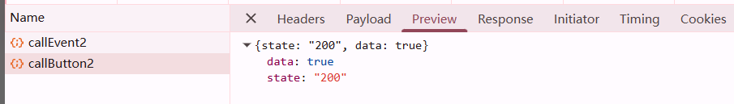


# 代码样例

```java
package cell.operate;

import cell.CellIntf;
import cell.gpf.dc.runtime.IDCRuntimeContext;
import cmn.anotation.InputDeclare;
import cmn.anotation.MethodDeclare;
import com.kwaidoo.ms.tool.CmnUtil;
import gpf.adur.data.AssociationData;
import gpf.adur.data.Form;
import java.time.*;
import java.time.format.DateTimeParseException;
import java.util.Date;
import java.lang.reflect.Method;
import java.text.SimpleDateFormat;
import java.text.ParseException;
import java.util.HashMap;

public interface lGeneralPanelOptExpr extends CellIntf {
    @MethodDeclare(
            label = "用户字段赋值"
            , how = ""
            , what = ""
            , why = ""
            //inputs参数必须定义完整，有些参数不需要暴露给规则函数作为入参的，可以从上下文变量中获取，格式：$xxx$
            , inputs = {
            @InputDeclare(desc = "", label = "GPF动作运行上下文", name = "rtx", exampleValue = "$IDCRuntimeContext$"),
            @InputDeclare(desc = "", label = "表单数据", name = "form", exampleValue = "$form$"),
            @InputDeclare(desc = "", label = "字段名称", name = "fieldStrs", exampleValue = "")
    }
    )
    default boolean setUserField(IDCRuntimeContext rtx, Form form, String fieldStrs) throws Exception {
        if (!CmnUtil.isStringEmpty(fieldStrs)) {
            AssociationData userAss = new AssociationData(rtx.getUserModelId(), rtx.getOperator());
            for (String field : fieldStrs.split(",")) {
                form.setAttrValue(field, userAss);
            }
            return true;
        }
        return false;
    }

    @MethodDeclare(
            label = "计算上班时长（HashMap 版）"
            , how = ""
            , what = ""
            , why = ""
            , inputs = {
            @InputDeclare(desc = "", label = "表单数据（HashMap）", name = "form", exampleValue = "$formData$"),
            @InputDeclare(desc = "", label = "开始字段名", name = "startField", exampleValue = ""),
            @InputDeclare(desc = "", label = "结束字段名", name = "endField", exampleValue = ""),
            @InputDeclare(desc = "", label = "结果字段名(可选)", name = "resultField", exampleValue = "")
    }
    )
    default double calcWorkingHours(HashMap form, String startField, String endField) throws Exception {
        if (form == null) form = new HashMap();

        Object sObj = form.get(startField);
        Object eObj = form.get(endField);

        long startMillis = parseToMillis(sObj);
        long endMillis = parseToMillis(eObj);

        ZoneId zone = ZoneId.systemDefault();
        ZonedDateTime cur = Instant.ofEpochMilli(startMillis).atZone(zone);
        ZonedDateTime end = Instant.ofEpochMilli(endMillis).atZone(zone);

        long totalMillis = 0L;

        LocalTime morningStart = LocalTime.of(9, 0);
        LocalTime morningEnd = LocalTime.of(12, 0);
        LocalTime afternoonStart = LocalTime.of(13, 0);
        LocalTime afternoonEnd = LocalTime.of(18, 0);

        ZonedDateTime dayCursor = cur.toLocalDate().atStartOfDay(zone);
        ZonedDateTime lastDay = end.toLocalDate().atStartOfDay(zone);

        while (!dayCursor.isAfter(lastDay)) {
            DayOfWeek dow = dayCursor.getDayOfWeek();
            if (dow != DayOfWeek.SATURDAY && dow != DayOfWeek.SUNDAY) {
                // morning period
                ZonedDateTime ms = dayCursor.with(morningStart);
                ZonedDateTime me = dayCursor.with(morningEnd);
                ZonedDateTime overlapStart = ms.isAfter(cur) ? ms : cur;
                ZonedDateTime overlapEnd = me.isBefore(end) ? me : end;
                if (overlapEnd.isAfter(overlapStart)) {
                    totalMillis += Duration.between(overlapStart, overlapEnd).toMillis();
                }

                // afternoon period
                ZonedDateTime as = dayCursor.with(afternoonStart);
                ZonedDateTime ae = dayCursor.with(afternoonEnd);
                overlapStart = as.isAfter(cur) ? as : cur;
                overlapEnd = ae.isBefore(end) ? ae : end;
                if (overlapEnd.isAfter(overlapStart)) {
                    totalMillis += Duration.between(overlapStart, overlapEnd).toMillis();
                }
            }
            dayCursor = dayCursor.plusDays(1);
        }

        double hours = totalMillis / 3600000.0;

        HashMap result = new HashMap();
        result.put("form", form);
        result.put("sObj", sObj);
        result.put("eObj", eObj);
        result.put("startMillis", startMillis);
        result.put("endMillis", endMillis);
        result.put("workingHours", hours);

        return hours;
    }


    /**
     * Parse common object types to epoch millis. Returns -1 on unknown/null.
     */
    static long parseToMillis(Object obj) {
        if (obj == null) return -1L;
        if (obj instanceof Number) return ((Number) obj).longValue();
        if (obj instanceof Date) return ((Date) obj).getTime();
        String s = obj.toString().trim();
        if (s.isEmpty()) return -1L;
        // try long millis
        try {
            return Long.parseLong(s);
        } catch (NumberFormatException ignored) {
        }
        // try ISO_INSTANT
        try {
            Instant it = Instant.parse(s);
            return it.toEpochMilli();
        } catch (DateTimeParseException ignored) {
        }
        // try common date/time patterns using SimpleDateFormat
        String[] patterns = new String[]{"yyyy-MM-dd HH:mm:ss", "yyyy-MM-dd'T'HH:mm:ss", "yyyy/MM/dd HH:mm:ss", "yyyy-MM-dd"};
        for (String p : patterns) {
            try {
                SimpleDateFormat sdf = new SimpleDateFormat(p);
                Date d = sdf.parse(s);
                if (d != null) return d.getTime();
            } catch (ParseException ignored) {
            }
        }
        return -1L;
    }
}

```


 