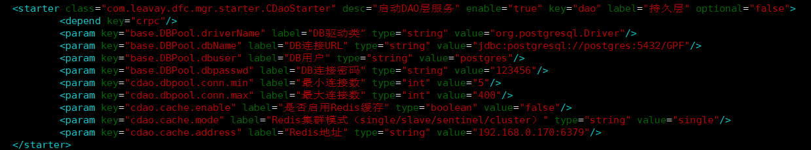
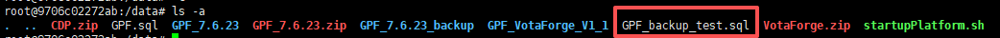
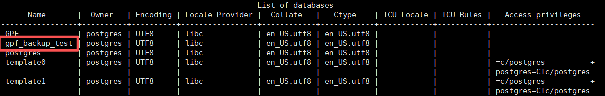
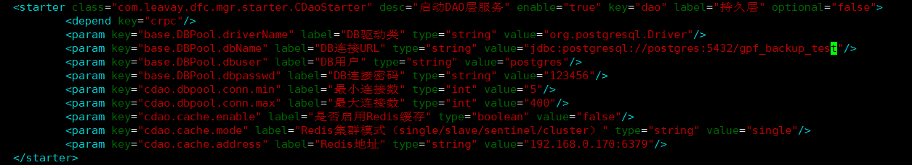
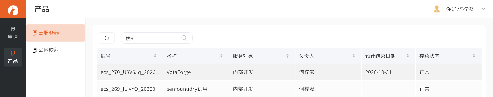
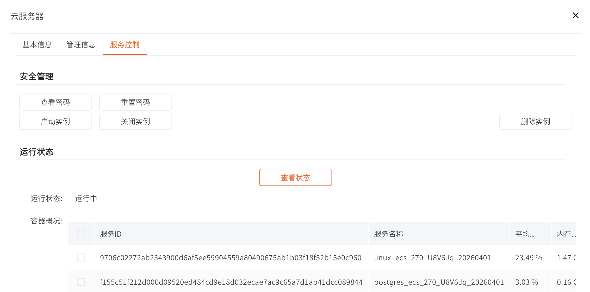

## 前期准备

1. 登录容器需要通过跳板机，登录跳板机后通过``ssh root@podman230 -p 容器端口``命令跳转到容器，所以要先申请跳板机账号

2. 如果不确定容器的端口可以再[计算资源管理](https://trial.kwaidoo.com/automation/ccrm/)的【申请PAAS环境】中找到之前的申请记录，在【映射配置】的【转发端口】后两位改成22就是ssh的端口，例如HTTP的转发端口为“27009”这ssh端口为“27022”。


## 备份

1.数据库默认的用户名是 “postgres”  密码为 “123456” ，通过 `psql -h postgres -U postgres` 命令即可链接到数据库，使用 `\l` 命令可以查看所有数据库。不确定当前链接的是哪个数据库可以在项目的“/conf/starter.xml”中找到	


2.在清楚要备份的哪个数据库的情况下，不用链接数据库，直接使用`pg_dump -h postgres -U postgres -d 数据库名 > /data/数据库名.sql`命令即可备份数据库，备份完成后文件在/data目录下



3.备份文件取回本地需要通过scp命令将文件先取回到跳板机在下载，也可以直接发送到需要使用的服务器

```
//scp命令格式为： scp 本地文件路径 用户名@远程 IP:远程路径
scp GPF_backup_test.zip hezp@14.18.100.250:/home/hezp
```


## 导入

1. 通过 `psql -h postgres -U postgres` 命令链接数据库，密码默认为“123456”

2. 使用 `create database 新数据库名` 命令创建一个新的数据库。这里需要留意创建是名称没用引号包裹会变为全小写，可以在创建后通过  `\l` 命令查看确认。

   

3. 使用 `psql -h postgres -U postgres 新数据库名 < /data/备份文件名.sql` 导入数据库内容，

4. 修改项目中“/conf/starter.xml”文件建配置，其中“DB链接URL”一行中修改里面的数据库名称改为新添加的数据库名称

   

5. 修改完配置后到[计算资源管理](https://trial.kwaidoo.com/automation/ccrm/)的【云服务器】重启对应的服务。

   

   

