## 申请环境

1. 登录https://trial.kwaidoo.com/automation/ccrm/，在【申请】的【申请PAAS环境】中提交申请

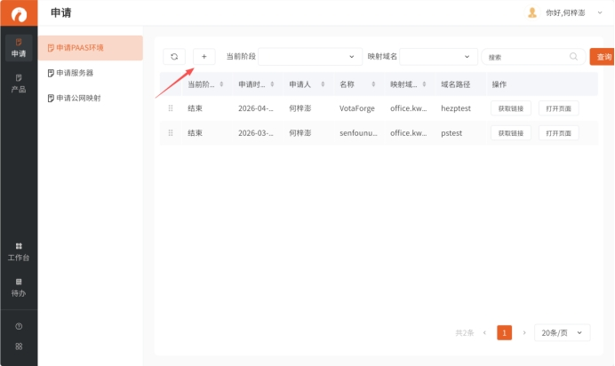 

 

2.  如果是用于测试和学习的环境【服务对象】选择**“内部开发”**，【负责人】选择自己

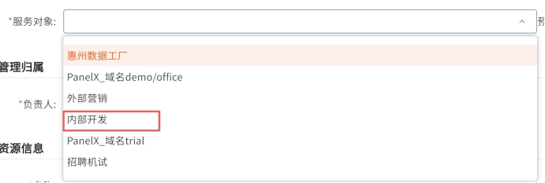 

 

 

3. 【名称】在服务模式中选择PAAS_VotaForge

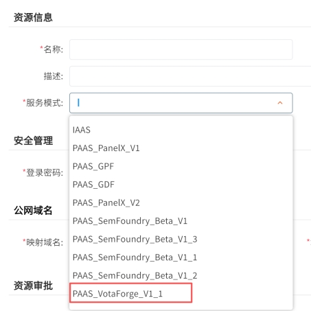 

 

4. 【域名路径】不能和已有了冲突，申请前先询问现在有哪些路径已在使用（测试时通常使用自己名字缩写加上“test”）

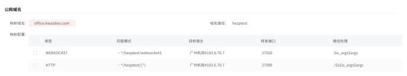 

 

##  管理环境

1. 申请完成后在界面可以获取环境链接，点击刚刚申请的那行的【获取链接】和【打开页面】可以复制申请到的服务地址或在新页面打开，但是链接不包括应用名需要添加**“VotaForge/”**才能打开VotaForge

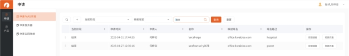 

 

2.  对环境的管理在【产品】的【云服务器】中选择对应的服务，可以执行关闭/启动容器和修改密码等操作

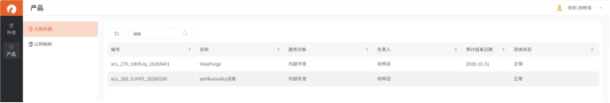 

 

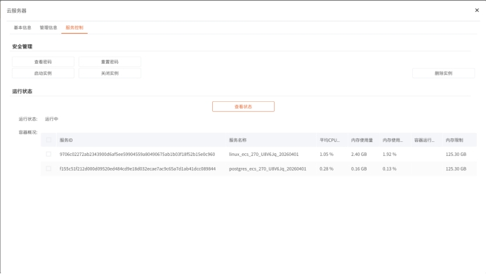

## **更新环境**

### 1. **获取新版GPF**

在http://14.18.100.250:8989/release/GPF/下载最新的压缩包

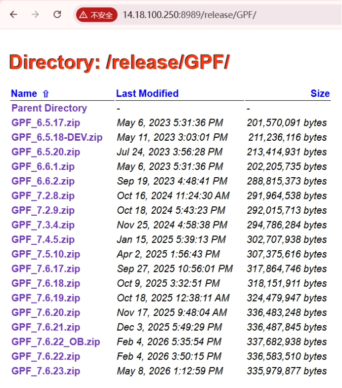 

 

### 2. **上传到服务器**

**2.1** 先将文件上传到跳板机，再使用命令将文件复制到服务的容器的“/data”路径下。例如`scp -P 27022 GPF_7.6.23.zip root@podman230:/data`（如果没要跳板机的登录账号需要向先申请）。

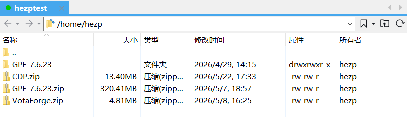

**2.2** 容器的端口可以再[计算资源管理](https://trial.kwaidoo.com/automation/ccrm/)的【申请PAAS环境】中找到之前的申请记录，在【映射配置】的【转发端口】后两位改成22就是ssh的端口，例如HTTP的转发端口为“27009”这ssh端口为“27022”.

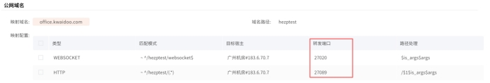 

**2.3** 容器的密码为申请时填写的密码，忘了的话可以在[计算资源管理](https://trial.kwaidoo.com/automation/ccrm/)的云服务器中查看或重置密码

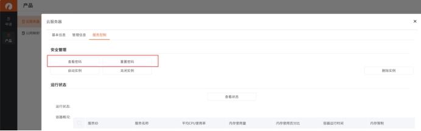 

**2.4** 进入“/data”路径后，解压刚刚上传的GPF压缩包开始修改配置

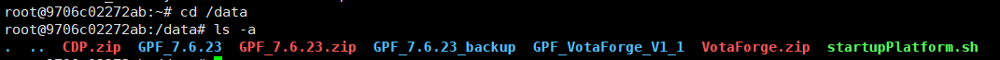

### 3. **修改配置**

进入容器并解压刚刚上传的压缩文件后还有几项配置需要改

**3.1** 在**/data**中有**startupPlatform.sh**脚本，需要编辑脚本把里面的文件路径改为新的位置。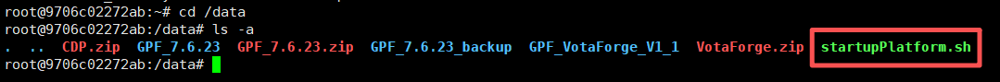

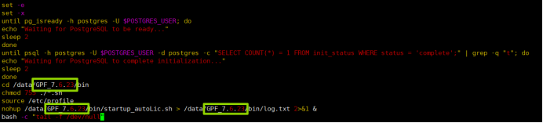

**3.2** 在项目的**“/conf”**中有下面几份文件需要修改， 可以在旧项目文件相同路径下复制，其中需要删除**starter.xml**需要删除gdk的starter。

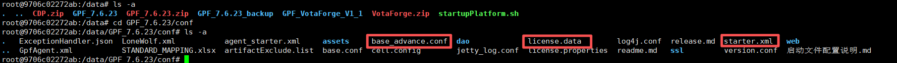

**3.3** 修改完配置后在[计算资源管理](https://trial.kwaidoo.com/automation/ccrm/)中重启容器

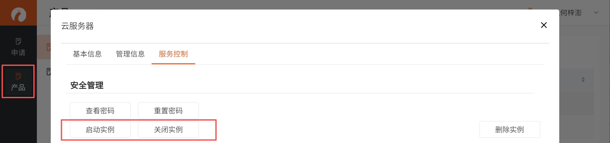

### 4. **更新前端包**

**4.1** 界面上更新

4.1.1 登录VotaForge选中【系统设置】，点击**”系统设置“**标题5次后会在下发出现【开发工具】菜单项。

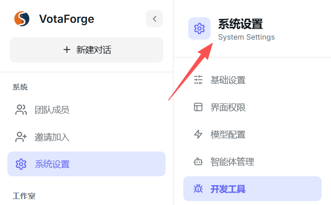

4.1.2 在【开发工具】中进入【前端包更新】，上传【VotaForge前端包】和【CDP前端包】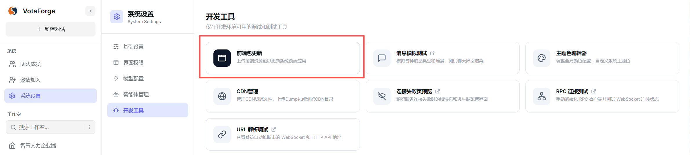

**4.2** 在服务器更新

4.2.1 用之前上传GPF相似，先讲前端压缩包上传到跳板机，在复制到项目文件的”**/webapps“**路径下并解压，例如`scp -P 27022 CDP.zip root@podman230:/data/GPF_7.6.23/webapps`

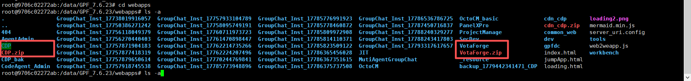

